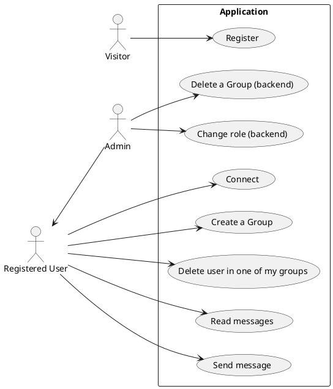

## Brève présentation du projet

XChangeo est le joli nom donné à notre application de messagerie instantanée développée en React.js, NodeJS. Quelques features sont entre autres : la création de compte, la connexion à l'application, la création d'un nouveau groupe et l'ajout de ses éventuels membres.
L'utilisateur connecté a aussi la possibilité de voir les groupes qu'il a créés, ceux auxquels il appartient et donc d'y envoyer des messages.

## Installation et configuration

Le guide suivant est destiné aux utilisateurs Linux pour installer l'application sur une machine nue à partir de votre dépôt

#### Installation de NodeJS sur votre système

  + WIndows ou MacOS : Télécharger et installer node via https://nodejs.org/en/download
  + Linux : tapez les commandes suivantes les unes après les autres
    
    curl -o- https://raw.githubusercontent.com/nvm-sh/nvm/v0.39.7/install.sh | bash
    
    nvm install 20
  
#### Installation de sqlite3 sous linux 

  Dans un terminal et à partir de votre repertoire racine, tapez
  
  sudo apt install sqlite3

### Installation des dépendances nécessaires
Dans chacun des répertoire backend et frontend, tapez la commande
  npm install

#### Dans le repertoire backend
  
  npm install express mandatoryenv sequelize

#### Mise en place de la base de données localement

  Depuis le répertoire du projet, tapez les commandes suivantes les unes après les autres : 
    cd ./backend
    npm run updatedb
#### Lancement de l'application serveuse
  + Une fois dans le répertoire backend, lancez l'application serveuse via la commande
    npm run start

#### Lancement de l'application cliente
  + Depuis le répertoire du projet, tapez les commandes suivantes les unes après les autres : 
    cd ./frontend
    npm run dev

  + Cliquez sur le lien  http://localhost:5173/ affiché dans le terminal pour accéder à l'application

#### Et voilà ! Vous y êtes ! Nous vous souhaitons de passer d'agréables moments avec vos proches et de rester au parfum des dernières nouvelles de ceux que vous aimez ! 

### XChangeo, votre application de messagerie inégalée !


## NOTRE APPLICATION DE MESSAGERIE EST INSTANTANNÉE. 

### Cas d'usage



### Maquette de notre application XChangeo
  Pour une question de facilitation des tests, nous avons attribué "j£$µis1p@s$F0rt" comme mot de passe à tous les utilisateurs (bien qu'il soit impossible de créer un utilisatuer avec ce mot de passe faible) dont voici les logins de quelques-uns d'entre eux : superadmin@gmail.com, elkaabi@gmail.com, luciengmail.com, john.doe@exemple.com,...


### Captures d'écran


  # Page de création de compte et de connexion à l'application


## Architecture du code


### FrontEnd

Le code du front-end est structuré comme suit : 
+ /components : contient nos composants réutilisés dans le code. Il s'agit entre autres de : 
  - Button: notre bouton personnalisé
  - Field : fieldset contenant des champs (children) de saisie et un bouton de soumission
  - GroupList : liste les différents groupes de l'utilisateur connecté
  - GroupAdder :  Crée un nouveau groupe 
  - MemberList : Liste les membres d'un groupe
  - MessageAdder : envoie un nouveau message dans un groupe
  - MessageList : liste les message postés dans un groupe
  - ...
  
+ /css : contient nos fichiers de style selon le composant
+ /utilities :les urls des apis de notre backend.
+ /views : contient nos différentes pages concrètes dans lesquelles sont utilisés nos composants


### Backend

#### Schéma de notre base de données

```plantuml
class User{
  name
  email
  passhash
  isAdmin : boolean
}

class Message{
  content
}

class Group{
  name
}

User "1" -- "n" Message : posts
Group "1" -- "n" Message : contains

User "n" -- "n"  Group : is member 
User "1" -- "n"  Group : create and own
```

#### Architecture de notre code
Pour la partie backend, nous avons ajouté des models, controllers et
routes pour chacun de nos différentes classes à savoir les utilisateurs (users), les groupes (groups) et messages(messages).
De plus, nous avons adopté un coding style facilicant la compréhension du code pour n'importe quel développeur (qu'il soit début ou expert).
Par exemple, pour les groupes, vous trouverez, en supposant que vous êtes dans le répertoire ./backend, le schéma des groupes
dans /models, ses controllers associés dans /controllers et les routes dans /routes. Les fichiers associés sont tous nommés
messages.js dans chacun de ces répertoires.

## Tests

### Backend

Pour le backend, nous avons fait des tests Jest pour les utilisateurs, groupes et messages conformement au cahier des charges du backend.
Ces tests situés dans le répertoire ./src/backend/\_tests_ couvrent la totalités des fonctionnalités que nos avons développées.
Vous pouvez lancer les tests en tapant 
  npm run test

### Frontend

Nos tests du frontend sont réalisés avec Cypress et sont localisés dans .src/frontend/cypress. Nos tests couvrent la création de compte et la connexion à l'appli ainsi que la gestion des groupes (création d'un nouveau groupe, ajout de nouveaux membres au groupe créé,...)  

